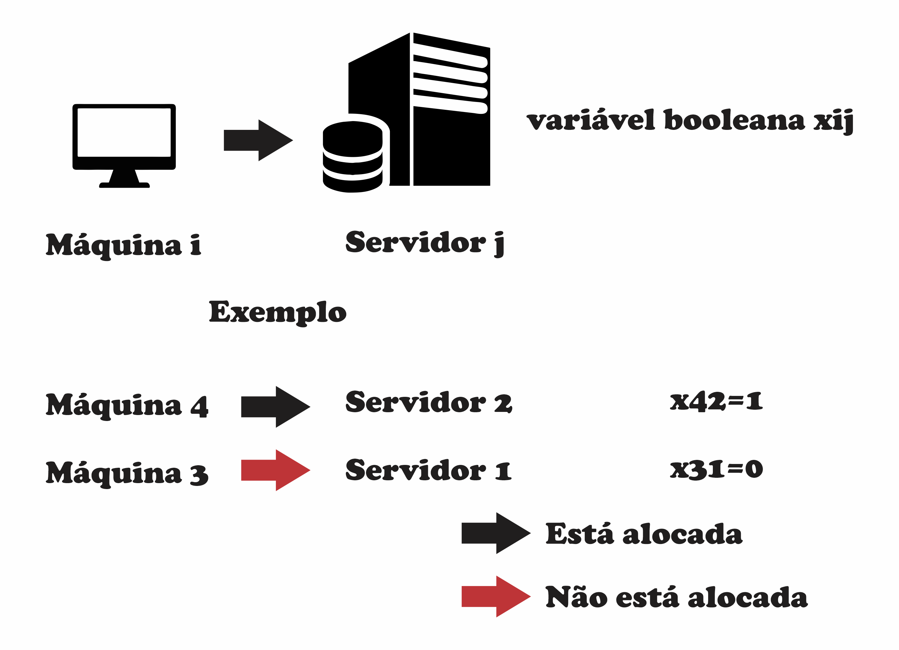

# Problema

Neste problema temos um conjunto $` {1…V} `$ de VMs, sendo que cada VM **i** possui um preço $` pi `$ e uma demanda de capacidade $` di `$. Temos também um conjunto de servidores $` {1…M} `$, com cada servidor **j** possuindo sua respectiva capacidade $` C_j `$. Para representar a alocação de uma VM **i** em um servidor **j** utilizamos uma variável de decisão booleana $` x_{ij} `$ que assume 1 no caso da máquina virtual **i** estar alocada no  servidor **j**, e 0 caso contrário. Assim, o que desejamos é a maximização do lucro:

$$
\text{maximizar } \left( \sum_{i=1}^{V} \sum_{j=1}^{M} p_i x_{ij} \right)
$$

sujeito a seguinte restrição:

$$
\sum_{i=1}^{V} d_i x_{ij} \leq C_j \text{, para todo servidor j,}
$$

---

# Entendendo o Problema

Para entender melhor o problema a figura abaixo mostra como funciona a variável booleana $` x_{ij} `$ que assume valor 1 se a máquina virtual **i** estiver alocada no servidor **j** e 0 caso contrário.

    

----

# Alocando números para o problema
Agora que entendemos o problema, devemos tratar o problema numericamente ao invez de genericamente. Para isso foi proposto um problema com 5 máquinas virtuais (com demandas e preços) e 2 servidores (com capacidades), mostrados na figura abaixo:

    

----

# Metodologia

Sabe-se a princípio existem 10 combinações de conexões máquina virtual $` \times `$ servidores (5 máquinas virtuais para 2 servidores). Porém cada uma dessas combinações podem assumir os valores 0 ou 1 já que a máquina virtual pode ou não está alocada no servidor j. Desta forma pode-se entender que cada uma dessas 10 combinações é um bit (0 ou 1) e o número real de combinações possíveis é de $` 2^{10} = 1024 `$ combinações de soluções a princípio.

Também foi proposto que uma mesma máquina virtual pudesse ser alocada nos dois servidores.

Assim um algoritmo de busca exaustiva foi elaborado no MATLAB e pode ser encontrado na função **busca_exaustiva.m** e uma script **main_busca_exaustiva** para testar essa função com os valores de preços, demandas e capacidades como descrito na seção anterior.

---

# Resultados

O resultado do algoritmo feito em MATLAB de busca exaustiva encontrou que a melhor combinação de máquinas virtuais alocadas em servidores é de:

- **Servidor 1** - máquinas 1, 2 e 3
- **Servidor 2** - máquinas 1 e 5

e o lucro ótimo obtido foi de R\$ 275,00

Foi comparado com a solução de um solver em python e o resultado obtido foi o mesmo da busca exaustiva:

[Google colab](https://colab.research.google.com/drive/1TSMIn_uTb4qzO2OyouqzFXC0bpb7IovI?usp=sharing)
